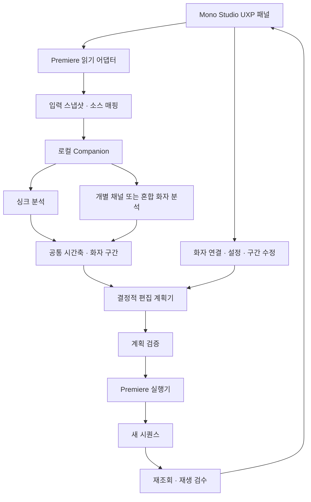
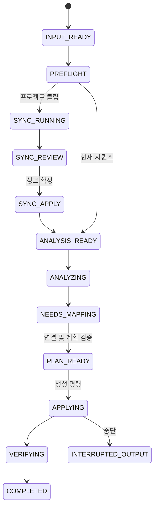

# Premiere 화자 중심 자동 컷 편집 — 상세 제품 설계

작성: 2026-10-05 · 디자인: Mono Studio · 대상: Windows / Premiere Pro UXP

**상태:** 합의한 제품 방향을 상세화한 설계다. 제품 구현, 모델 설치, Premiere 편집 적용, 처리 속도와 인식 품질은 아직 검증하지 않았다. 문서의 수치는 별도 표시가 없는 한 제안 기본값 또는 검증 목표이며 실측 결과가 아니다.

## 문서 구성

이 문서는 제품 범위와 공통 계약을 정의한다. 세부 문서는 해당 분야의 구체 규칙을 정의한다. 같은 값을 중복 정의한 경우 서로 일치해야 하며, 충돌은 구현 전에 문서 양쪽에서 해결한다.

| 문서 | 범위 |
| --- | --- |
| 이 문서 | 전체 흐름, 구조, 시간·데이터·통신 계약, 상태, 복구, 검증 관문 |
| [Mono Studio 화면 상세](details/mono-studio-ui.md) | 실제 패널 구성, 디자인 토큰, 입력·버튼·오류·검토 상태 |
| [Premiere 연동 상세](details/premiere-integration.md) | 공개 API 근거, 효과·오디오 보존, 새 시퀀스 적용과 실제 검증 |
| [싱크·음성 분석 상세](details/audio-sync-and-speakers.md) | 자동 싱크, 분리 마이크, 혼합 녹음, 겹말, 긴 파일, 로컬 모델 |
| [편집 정책·검수 상세](details/editing-policy-and-qa.md) | 규칙 우선순위, 프레임 단위 예제, 사용자 수정, 시험·합격 기준 |

## 1. 제품 목적과 합의 사항

Premiere 프로젝트에 가져온 여러 카메라 영상과 녹음을 선택하면 촬영 시간에 맞춰 정렬하고, 발언 구간에 따라 카메라를 전환한 **수정 가능한 새 Premiere 시퀀스**를 만든다. 사용자는 Premiere 패널에서 작업을 시작하고 Premiere 타임라인에서 결과를 검토·수정한다.

성공은 패널이 열리는 것에 그치지 않는다. 실제 소스를 읽고, 원본을 보존하고, 계획한 프레임에 컷을 만들고, Premiere에서 재생해야 한다. 설치·연동·음성 품질·편집 품질은 각각 검증한다.

| ID | 사용자 확정 요구 | 제품에서 보이는 결과 |
| --- | --- | --- |
| R01 | 롱폼·팟캐스트 화자 중심 컷 | 발언하는 사람의 카메라로 전환 |
| R02 | 개별 마이크와 혼합 녹음 모두 | 두 분석 경로가 같은 편집·검토 흐름으로 연결 |
| R03 | 자동 싱크 | 실제 시간차 추정과 불확실한 파일 검토 |
| R04 | Mono Studio UI | 차콜·흑백·얇은 선·흰색 주 버튼 |
| R05 | Premiere와 확실한 연동 | 실제 UXP 패널, 실제 소스 읽기와 시퀀스 생성 |
| R06 | 로컬 분석 기본 | 핵심 컷에 ChatGPT 로그인·음성 API 비용 불필요 |
| R07 | 짧은 반응·겹말 구분 | 짧은 반응은 유지, 지속 겹말은 투샷·전체 화면 우선 |
| R08 | 원본 보존 | 원본 미디어·시퀀스를 유지하고 새 결과 생성 |

### 설계 기본안과 가정

- Windows와 설치된 Premiere Pro 26.5.2를 첫 검증 대상으로 한다. 다른 버전·macOS 지원을 뜻하지 않는다.
- 한 촬영 세션이 한 분석 단위다. 세션을 넘어 사람 ID를 자동 공유하지 않는다.
- 기본 결과는 대화 길이를 유지하는 영상 컷이다. 대사·침묵을 삭제하지 않는다.
- 감지 화자와 카메라는 사용자가 처음 연결한다. 이름·얼굴을 음성만으로 자동 식별하지 않는다.
- 전사와 ChatGPT 편집 도우미는 선택 확장이다. 기본 화자 컷은 없어도 작동해야 한다.
- 첫 검증 자료는 2~4명, 2~5개 카메라, 15·60·120분 세션을 포함한다. 이는 시험 범위 제안이다. 지원 한도·처리 시간은 실측 후 정하며 데이터 구조는 특정 인원 수에 고정하지 않는다.

## 2. 입력 범위와 차단 조건

| 항목 | 기본 지원 설계 | 실행 전 차단·검토 조건 |
| --- | --- | --- |
| 시작점 | 프로젝트 클립 / 현재 시퀀스 | 프로젝트 없음, 입력 없음 |
| 영상 | 카메라별 일반 트랙, 1배속, 분할 파일 | 중첩 내부 편집, 속도 변경·역재생, 미검증 네이티브 멀티캠 |
| 오디오 | 개별 파일·트랙·파일 내부 채널 | 디코딩 실패, 범위 없음, 중복 채널 오매핑 |
| 싱크 | 공통 음성 / 확인한 공통 타임코드 / 수동 오프셋 | 공통 근거 없음, 연결되지 않은 파일, 드리프트 |
| 카메라 | 사람별 기본 카메라, 선택적인 WIDE·예비 카메라 | 출력 범위 중 허용한 영상이 없는 구간 |
| 기존 편집 | 검증된 효과·위치·배율·키프레임 보존 | 보존 불가 효과·트랜지션·트랙 합성 관계 |
| 결과 | 편집 가능한 일반 클립의 새 시퀀스 | 외부 렌더 영상만 제공하는 결과는 완료 아님 |

MP4 같은 확장자만 보고 지원을 선언하지 않는다. Premiere에서 온라인이고 분석 엔진에서 디코딩되며 시간 매핑 검증을 통과해야 한다. 가변 프레임레이트는 PTS 매핑 검증 전 자동 적용을 차단한다. 변환이 필요하면 별도 파생 파일로 처리하고 원본을 덮어쓰지 않는다.

카메라 트랙과 보호할 그래픽·자막·조정 레이어를 구별한다. 다른 트랙과의 합성 관계를 보존할 수 없다면 적용을 막는다. 소스를 조용히 제외하거나 효과를 제거해 성공시키지 않는다.

**기본 범위 밖:** 사람별 음성 복원, 자동 믹싱·노이즈 제거, 자막 생성, 대사·무음 삭제, 숏폼, 얼굴 추적·자동 줌·색보정, 결제·라이선스 서버. 필요하면 후속 범위로 별도 설계한다.

## 3. 두 가지 시작 경로

### 3.1 프로젝트 클립에서 시작

1. Premiere 프로젝트에서 카메라 영상·외부 녹음을 선택하고 `선택 항목 가져오기`를 누른다.
2. 같은 카메라의 분할 파일을 묶고 기준 녹음·분석 채널·최종 재생 오디오를 지정한다. 파일명은 묶음 제안에만 쓰며 싱크 근거로 삼지 않는다.
3. 자동 싱크를 실행한다. 소스마다 근거·배치 후보·시작/중간/끝 잔여 오차·검토 사유를 표시한다.
4. 미해결 소스를 수동 정렬하거나 명시적으로 제외한다. 필요한 범위의 영상·오디오 존재를 검사한다.
5. `싱크 시퀀스 만들기`로 새 일반 트랙 시퀀스를 만든다. 이는 싱크 검토용이며 최종 컷 결과가 아니다.
6. 기준 시퀀스에서 화자 분석 → 화자 연결 → 편집안 → 별도 편집 시퀀스로 진행한다.

FPS는 기준 카메라의 유리수 FPS를 제안하고 생성 전 보여준다. 해상도·픽셀 비율·오디오 설정은 검증된 프리셋에서 선택한다. 오디오 기준 파일로 영상 FPS를 추정하지 않는다. 카메라별 FPS가 다르면 소스 PTS와 출력 시퀀스 매핑을 확인한다.

### 3.2 현재 시퀀스에서 시작

1. `현재 시퀀스 읽기`로 대상을 고정한다. 사용자가 다른 탭을 열어도 분석 대상은 바뀌지 않는다.
2. 전체 또는 In/Out 범위를 선택한다. 카메라별 트랙/클립 묶음, 분석 소스·채널, 보호 트랙을 지정한다.
3. 현재 배치를 기준 싱크로 사용한다. 싱크 검사는 선택할 수 있지만 원본 위치를 자동 수정하지 않는다.
4. 기본 분석은 지정한 소스 오디오를 타임라인 위치에 맞춰 읽는다. Premiere 마스터 믹스·트랙 효과가 반영된 출력이라고 표시하지 않는다.
5. 화자 분석과 연결 후 별도 시퀀스에 결과를 만든다. 범위 밖은 기준 시퀀스의 배치와 화면을 보존한다.

프로젝트 저장 위치·안정적인 식별을 확보한 뒤 결과를 생성한다. In/Out 역전·빈 시퀀스·소스 시간 변환 불명확은 사전 검사에서 거부한다.

## 4. 시스템 구조와 대안

| 방식 | 장점 | 부담 | 결정 |
| --- | --- | --- | --- |
| UXP + 로컬 Companion | 패널·긴 분석 분리, 취소·캐시·모델 관리 용이 | 별도 설치·연결 필요 | 기본 구조 |
| UXP + 클라우드 | 로컬 연산 부담 감소 | 업로드·사용료·네트워크 의존 | 기본 경로 제외 |
| UXP Hybrid 네이티브 | 배포 구성 통합 가능 | C++·플랫폼 빌드 부담 | 필요할 때 후속 검토 |



| 구성 | 책임 | 경계 |
| --- | --- | --- |
| UXP 패널 | 입력, 연결, 설정, 진행·검토, 사용자 명령 | 모델 연산·장시간 디코딩 안 함 |
| Premiere 어댑터 | 호스트 읽기·지원 검사·적용·재조회 | 임의 UI 클릭 자동화에 의존하지 않음 |
| Companion | 미디어 준비, 로컬 모델, 작업·캐시 | 원본 프로젝트를 직접 편집하지 않음 |
| 계획기 | 구간+정책 → 재현 가능한 컷 | 외부 AI 없이 결정, 원음 의미 추측 안 함 |
| 검증기 | 시간·범위·커버리지·원본 변화·실제 결과 검사 | 모델 추정을 정답으로 인증하지 않음 |

제안 기술은 패널·호스트 계약에 TypeScript, 미디어·모델에 독립 Python 런타임이다. 구체 버전은 Windows·GPU·배포 검증 후 고정한다. 호스트 잠금 안에서 모델 계산·네트워크·디코딩을 기다리지 않는다.

## 5. 음성 분석과 전사의 구분

전사는 말을 글자로 만드는 일이고 화자 구분은 시간 구간에 사람 ID를 붙이는 일이다. 기본 컷은 후자를 사용한다.

- 개별 마이크: 사람–채널 연결, 음성 활성도, 게인 차이, 누음을 함께 평가한다. 제안 VAD는 Silero ONNX이며 식별·누음 처리는 별도 정책이다.
- 혼합 녹음: pyannote Community-1을 로컬 후보로 사용한다. 일반 화자 구간으로 동시 발화를 보존한다. Windows 실행·한국어 품질은 별도 검증한다.
- 화자 연결: 서로 떨어진 단독 발화 예시를 듣고 이름·카메라를 연결한다. 다른 사람이 합쳐졌거나 같은 사람이 나뉘었으면 구간 교정·병합을 제공한다.
- 긴 녹음: 청크마다 새로 붙은 SPEAKER_00을 같은 사람으로 간주하지 않는다. 지역 ID→세션 ID→사용자 연결을 구별한다.
- 불확실성: 음성 약함·누음·미매핑·청크 연결 미정 같은 근거를 보여준다. 존재하지 않는 확률 점수를 만들지 않는다.

분석용 PCM의 리샘플링·레벨 보정은 원본 재생 오디오에 적용하지 않는다. 기본 결과 오디오는 기준 시퀀스의 배치·길이·채널·볼륨·효과·음소거를 유지한다.

정상 디코딩·분석을 마쳤으나 일부 구간의 화자를 판단하기 어려운 경우만 `판별 불가`로 두고 화면 유지를 허용한다. 선택 범위의 확정 화자 ID에 카메라가 연결되지 않았으면 연결을 완료하기 전 적용을 막는다. 분석 오디오가 실제로 없거나 모델이 실패한 경우는 별도 오류이며 무음·판별 불가로 바꾸지 않는다. 화면 밖 화자도 사용자가 지정한 전체 화면 등 명시적 카메라 정책에 연결해야 한다.

## 6. 자동 싱크 계약

각 소스는 `sessionTime = sourceTime + offset`으로 부호를 고정한다. 소스별 오프셋, 근거, 검사 지점, 잔여 오차를 남긴다. 공통 타임코드의 존재와 실제 시계 동기화를 구별한다.

| 상황 | 처리 |
| --- | --- |
| 같은 소리가 녹음됨 | 분산된 유효 창으로 시간차를 추정하고 다른 창에서 확인 |
| 공통 시계 타임코드 | FPS·DF/NDF·날짜·자정·리셋 확인 후 배치, 가능한 음성 대조 |
| 분할 파일 | 조각별 위치 검증, 실제 녹화 공백 유지 |
| 기준과 직접 안 겹침 | 검증된 중간 소스 연결과 누적 오차로 판단 |
| 드리프트 | 일정 오프셋으로 맞지 않는 오차를 표시하고 자동 확정 차단 |
| 근거 없음 | 수동 대응점·오프셋 또는 소스 제외 필요 |

싱크용 현장음과 최종 재생 음원을 구별해 중복 재생하지 않는다. 원시 추정 오차와 프레임 배치 양자화 오차를 따로 기록한다. 시작·중간·끝의 위치 오차 1프레임 이내는 시험 목표이며 모든 입력의 정확도 보장이 아니다. 자동 속도 변경·시간 늘이기로 드리프트를 조용히 보정하지 않는다.

## 7. 카메라와 편집 정책

사람마다 기본 카메라를 연결한다. 여러 사람이 하나의 투샷을 공유할 수 있다. WIDE는 별도 카메라 역할이며 화자 수에 포함하지 않는다. WIDE와 투샷 모두 실제 포함된 사람을 지정한다. 두 사람 투샷을 세 사람 겹말의 전체 화면으로 오인하지 않는다. 원래 비활성 클립이나 출력이 꺼진 카메라 트랙을 자동 활성화해 가용 영상을 채우지 않는다.

### 결정 우선순위

1. 지원 범위·시간·오디오 보존·영상 커버리지 검사. 해소되지 않는 결손은 적용 차단.
2. 유효한 사용자 고정 구간과 카메라.
3. 판별 불가 구간은 유효한 현재 화면 유지와 검토 표시.
4. 지속 겹말은 적합한 WIDE/투샷. 없으면 현재 화면 유지와 검토 표시.
5. 짧은 경쟁 발화는 현재 화면 유지. 맞장구의 의미를 이해한 판정이 아님.
6. 충분한 단독 발화는 연결된 카메라 후보.
7. 일반 전환에 최소 화면 유지 시간 적용.

| 설정 | 제안 기본값 | 의미 |
| --- | --- | --- |
| 최소 화면 유지 M | 2.0초 | 일반적인 화면 전환 간 최소 간격 |
| 짧은 반응 억제 B | 켜짐 / 0.6초 이하 | 짧은 경쟁 발화에 화면 유지 |
| 지속 겹말 O | 0.8초 이상 | 여러 사람의 연속 동시 발화에 전체 화면 후보 |
| 경계 추가 보정 | 0프레임 | 임의 선행·지연 없음 |
| 침묵 | 화면 유지 | 대화 길이를 삭제하지 않음 |

최소 길이 예외는 유효한 사용자 고정 경계, 현재 영상 자체의 종료, 지속 겹말 진입이다. 겹말 종료는 일반 최소 유지 규칙을 따른다. 마지막 잔여 구간이 짧아도 분석 범위를 늘리지 않는다. 전환이 미뤄진 경우 그때도 화자가 발화 중이어야 전환한다.

사전 분석은 지속 겹말임을 확인한 뒤 시작 경계에 컷을 둘 수 있다. O초를 확인하는 시간이 실제 컷 지연이 되는 것은 아니다. 같은 카메라에 연결된 사람끼리 바뀌면 추가 컷을 만들지 않는다.

자동 카메라의 영상 공백 대체는 허용한 WIDE → 현재 카메라 → 사용자가 지정한 예비 카메라 순이다. 지정하지 않은 다른 사람 화면을 임의 선택하지 않는다. 사용자 고정 카메라의 공백은 자동 대체 없이 충돌로 처리한다. 영상이 없는 구간에 마지막 프레임 정지·검은 화면을 삽입하지 않는다. 상세한 조건과 30fps 예제는 [정책 문서](details/editing-policy-and-qa.md)를 따른다.

## 8. 공통 시간 계약

| 종류 | 저장 | 목적 |
| --- | --- | --- |
| 원본 음성 | 정수 sampleIndex + sampleRate | 원시 분석 위치 |
| 미디어 | 정수 PTS + 유리수 timeBase | 실제 영상·음성 시간 |
| 시퀀스 | 정수 frameIndex + FPS `{num, den}` | 정책·경계 검사 |
| Premiere | ticks 10진 문자열 | JS 안전정수 범위 초과 방지 |
| 화면 표시 | HH:MM:SS:FF + DF/NDF | 사람이 읽는 표시, 계산 기준 아님 |

구간은 모두 `[start,end)`다. 공통 경계를 한 번 변환하고 앞 컷의 end와 뒤 컷의 start에 같은 값을 쓴다. 절대 시간에서 가장 가까운 프레임으로 정렬하며 정확한 반 프레임은 뒤 프레임으로 보낸다. 길이를 29.97 같은 소수로 반복 더하지 않는다. 설정 임계값은 `ceil(초 × FPS분수)` 프레임으로 계산한다.

1배속 클립은 `sourceTime = sourceIn + (sequenceTime - clipStart)`다. 표시용 시작 타임코드와 내부 frameIndex 0을 구별한다. 오디오 샘플은 불필요하게 영상 프레임에 반올림하지 않는다. 원본 경계·양자화 결과·잔여 오차를 함께 보존한다.

## 9. 데이터 계약

다음은 제품 내부 제안 객체 이름이며 Adobe API 이름이 아니다. 모든 아티팩트에 schemaVersion, jobId, revision, createdAt을 포함한다. 입력·분석·연결·계획·적용의 revision을 분리한다.

| 객체 | 주요 필드 | 불변 조건 |
| --- | --- | --- |
| InputSnapshot | project/sequenceRef, targetMode, fps, range, tracks, clips, sources, supportFlags, snapshotHash | 분석 대상 고정, 적용 전 재검증 |
| SourceAsset | assetId, canonicalPath, size, mtime, fingerprint, streams, proxyRelation | 원본·프록시 혼동 금지 |
| SourceClip | instanceKey, projectItemRef, trackRef, start/endTicks, in/outTicks, speed, channelMap, effectFingerprint | 같은 파일의 서로 다른 인스턴스 구별 |
| SyncPlan | referenceAsset, offsets, evidenceWindows, residuals, unresolved, exclusions | 소스 전부 배치·검토·제외 중 하나 |
| SpeakerAnalysis | analysisKey, modelRevision, intervals, sessionSpeakerIds, evidence, reviews | 원시 경계·겹말 보존 |
| SpeakerMapping | mappingRevision, sessionSpeakerId, displayName, microphoneRef, cameraId | 임시 화자 ID와 실명 구별 |
| CameraBinding | cameraId, role, coveredSpeakers, clips, coverage, fallbackOrder | 해당 시간의 실제 영상 필요 |
| Policy | policyRevision, minShot, shortTurn, overlap, overrides | 기본값·사용자 값 구별 |
| EditPlan | planHash, snapshotHash, analysisKey, mappingRevision, segments, reviews | 시간·커버리지·소스 범위 유효 |
| ApplyReceipt | outputSequenceRef, planHash, batches, readback, sourceUnchanged, status | API 요청 성공만으로 완료 불가 |

호스트가 영속 클립 ID를 제공한다고 가정하지 않는다. instanceKey는 제품의 스냅샷 안에서 만든 키일 수 있으며 프로젝트·트랙·배치·소스·시간을 다시 읽어 같은 대상을 확인한다. 이름만으로 대상을 찾지 않는다.

effectFingerprint와 channelMap은 실제 읽을 수 있는 범위와 지원 상태를 함께 기록한다. 조회 불가 값은 `unknown`으로 구분하고 읽은 필드 목록을 남긴다. null 두 개나 빈 hash가 같다는 이유로 효과·오디오 보존을 통과시키지 않는다. 전체 보존을 확인할 수 없는 구성은 호스트 재생 비교와 검증된 지원 목록으로 범위를 한정하며, 필수 보존 근거를 확보하지 못하면 적용을 차단한다.

각 편집 segment는 startFrame, endFrame, cameraId, sourceClipInstanceKey, sourceIn, sourceOut, reasonCodes, reviewIds, manualOverrideId를 가진다. sourceIn/sourceOut은 원본 ProjectItem 시작을 기준으로 한 Premiere tick의 10진 문자열이며, 원시 PTS·PCM 좌표는 별도 매핑에 보존한다. 카메라가 같아도 녹화 파일 경계가 있으면 실제 소스 세그먼트는 구별한다. 화면 전환 수와 실행 과정에서 생성한 물리 클립 조각 수는 별도로 집계한다.

```json
{
  "schemaVersion": 1,
  "fps": { "num": 30, "den": 1 },
  "segment": {
    "startFrame": 300,
    "endFrame": 360,
    "cameraId": "wide",
    "sourceClipInstanceKey": "wide-clip-01",
    "reasonCodes": ["OVERLAP_SUSTAINED"],
    "reviewIds": [],
    "manualOverrideId": null
  }
}
```

이 JSON은 구간 구조 설명용이며 전체 계약 예시나 실제 분석 결과가 아니다. 원시 모델 결과와 정규화 결과, 사용자 교정을 별도로 저장한다. 검토 확인으로 원시 결과를 덮어쓰지 않는다.

## 10. 로컬 통신과 작업 인터페이스

Companion은 loopback에만 바인딩한다. 발견한 고정 포트를 무조건 신뢰하지 않고 프로토콜·실행 버전·세션 인증을 확인한다. 아래는 제품 내부 API 제안이다.

| 경로 | 목적 |
| --- | --- |
| `GET /v1/health` | protocol·app 버전, 장치·모델 준비 상태 |
| `POST /v1/jobs` | 스냅샷과 허용 소스 등록, 작업 ID 생성 |
| `POST /v1/jobs/{id}/sync` | 싱크 분석 |
| `POST /v1/jobs/{id}/analyze` | 모드·채널·모델 기준 화자 분석 |
| `GET /v1/jobs/{id}` | 상태·단계·진척·오류 |
| `GET /v1/jobs/{id}/artifacts/{kind}` | 검증된 분석·계획·예시 정보 |
| `POST /v1/jobs/{id}/plan` | 분석·연결·정책으로 편집안 생성 |
| `POST /v1/jobs/{id}/cancel` | 취소 요청과 확인 |

HTTP 서비스가 Premiere를 직접 수정하지 않는다. 사용자의 생성 명령을 받은 패널 실행기가 검증된 planHash를 적용한다. 외부 URL 요청만으로 Premiere 편집이 가능한 공개 적용 API를 만들지 않는다.

초기에는 JSON 요청과 진행 중 1~2초 간격 상태 조회를 사용한다. 숨겨진 패널은 조회 빈도를 낮추며 Companion 분석은 유지할 수 있다. revision과 requestId로 중복·역순 응답을 처리한다. 메시지 브로커나 WebSocket은 필수로 넣지 않는다.

서비스는 사용자 승인 소스 집합에만 접근한다. 경로를 정규화해 허용 목록과 대조하고 임의 셸 명령을 받지 않는다. 요청 인증 토큰은 세션별로 생성해 사용자별 보안 저장·접근 권한으로 보호한다. 인증을 Origin 헤더 하나에 의존하지 않는다. 패널의 실제 Origin·네트워크 권한은 호스트에서 검증한다.

UXP에 일반 Node child_process가 있다고 가정하지 않는다. 개발 초기에는 Companion을 따로 실행하며, 배포는 검증한 실행기 또는 Adobe 외부 앱 실행 경로로 연결한다. 패널+Companion의 버전 불일치는 분석 전에 안내한다.

## 11. 상태와 무효화

| 축 | 상태 |
| --- | --- |
| Premiere | 연결됨 / 프로젝트 없음 / 시퀀스 없음 / 지원 확인 필요 |
| Companion | 연결됨 / 시작 필요 / 버전 불일치 / 응답 없음 |
| 모델 | 준비됨 / 다운로드 필요 / 로딩 / 오류 |
| 분석 | 대기 / 싱크 중 / 싱크 검토 / 화자 분석 / 연결 필요 / 준비 |
| 적용 | 사전 검사 / 적용 중 / 결과 검사 / 완료 / 중단 결과 |

연결됨과 완료를 같은 표시로 합치지 않는다. 전체 작업의 정상 흐름은 다음과 같다. 파일 경로만 SYNC 상태를 거친다.



각 장기 단계에는 FAILED와 CANCELED가 별도로 존재한다. 모델 오류·결손 입력을 `발화 없음`으로 처리하지 않는다. 편집 적용 중 설정 변경은 막고 다음 결과를 위한 수정으로 안내한다.

| 변경 | 무효화 | 재사용 |
| --- | --- | --- |
| 최소 길이·겹말 정책 | 편집안 | 싱크·음성 분석 |
| 표시 이름만 | 메타데이터 | 카메라가 같으면 컷 구조 |
| 화자→카메라 | 편집안 | 음성 분석 |
| 특정 구간 화자 교정 | 관련 편집안 | 원시 분석과 교정 이력 |
| 채널·녹음 모드·모델 | 분석 이후 | 동일 소스·싱크 |
| 싱크 위치 | 기준 시간축·계획 | 동일 소스 PCM·소스 시간 분석 |
| 원본 클립·효과·범위 | 스냅샷·적용 | 키가 같은 소스 캐시만 |

## 12. Premiere 적용 계약

1. 작업에 고정한 프로젝트·시퀀스가 존재하는지 확인한다. 다른 활성 탭에 적용하지 않는다.
2. 원본 클립·소스·시간·효과·오디오를 다시 읽어 스냅샷과 대조한다. 변경되면 계획을 무효화한다.
3. 전체 범위·온라인 소스·영상 커버리지·효과 보존 지원을 확인한다.
4. 작업 소유의 새 시퀀스를 만들고 식별자를 기록한다. 이름이 같아도 식별자로 구별한다.
5. 검증한 호스트 작업을 적절한 묶음으로 적용하고 묶음별 기록을 남긴다.
6. 실제 결과 클립·시간·오디오·보호 트랙을 재조회해 계획과 비교한다.
7. 원본 변화가 없고 일치하면 완료 처리한다. 실제 재생 확인은 별도 검수 항목이다.

기존 시퀀스는 복제 후 선택 카메라 구간을 편집하는 경로를 우선 검증한다. 원본 ProjectItem의 공유 In/Out을 임시 변경하지 않는다. 인스턴스 효과·키프레임 보존이 불가능할 때 단순 재삽입으로 우회하지 않는다.

영상 컷 때문에 오디오가 잘리거나 linked selection으로 오디오가 삭제되지 않아야 한다. Action 생성·트랜잭션·lockedAccess의 실제 계약, 클립 복제·트리밍·링크 보존은 [연동 문서](details/premiere-integration.md)의 호스트 관문을 통과해야 한다.

## 13. 취소·재시도·중복 방지

| 상황 | 동작 |
| --- | --- |
| 분석 취소 | 안전한 단계에서 중지 확인; 완료 캐시만 재사용 |
| 패널 닫힘 | 분석 계속 가능; 작업 ID로 재연결 |
| Premiere 종료 | 분석 결과 보관, 적용은 중단 결과 |
| Companion 종료 | 완료 산출물 보존, 미완성은 캐시 완료 등록 금지 |
| 생성 중복 클릭 | requestId·planHash로 기존 진행 작업 연결 |
| 적용 중 취소 | 호스트 작업 경계에서 정지, 완료 표시 금지 |
| 부분 결과로 재시작 | 실제 내용·receipt 대조, 자동 덧붙이기 금지 |
| 결과를 사용자가 수정 | 자동 삭제·덮어쓰기 금지 |

대형 적용의 단일 Undo를 보장하지 않는다. 검증된 작업 단위의 Undo와 원본 보존·새 결과 재생성을 복구 수단으로 삼는다. 자동 정리는 작업 소유 식별과 생성 후 사용자 변경 여부가 확인된 미완성 결과에만 허용한다. 확인 불가능하면 남겨 두고 `중단된 결과`로 표시한다.

결과 시퀀스명 예시는 `<원본명> · 자동 컷 · <작업 식별자>`다. 내부 이름·경로·소스에는 개별 납품 파일용 시각 접두사 규칙을 강제로 적용하지 않는다.

## 14. 캐시·저장·장시간 처리

| 내용 | 위치 제안 | 보존 원칙 |
| --- | --- | --- |
| 앱 설정·연결 정보 | 사용자별 앱 데이터 | 계정 간 공유 안 함 |
| 모델 | 사용자 선택 모델 폴더 | revision·해시·라이선스 기록 |
| 작업 메타데이터 | 사용자별 jobs 폴더 | 스냅샷·매핑·계획·검토·receipt 분리 |
| PCM·파형·임베딩 | 사용자 선택 캐시 | 재생성 가능 여부·크기 표시 |
| 원본 프로젝트·미디어 | 기존 사용자 위치 | 이동·삭제·이름 변경 안 함 |

캐시 키는 소스 지문·스트림·채널·범위·전처리·모델 revision을 포함한다. 파일 크기·수정 시각만으로 영구 동일성을 보장하지 않는다. 필요한 해시는 비동기로 계산한다. 키가 달라지면 기존 계획을 새 소스에 적용하지 않는다.

활성 작업 캐시는 자동 삭제하지 않는다. 완료 작업의 재생성 가능한 캐시만 사용자 용량 설정에 따라 정리한다. 수동 교정·계획·receipt는 예산 정리에서 제외한다. 기본 예산은 실제 여유 공간을 보고 제안하며 고정 대용량을 몰래 할당하지 않는다.

처리량을 측정할 수 있는 단계만 퍼센트를 보여준다. 추정 남은 시간은 충분한 진행 자료가 있을 때 제공한다. GPU 메모리 부족은 실패를 표시하고 CPU 재시도를 제공한다. 장치만 변경해도 실행 환경을 기록하며 모델·설정 변경은 새 analysisKey로 구별한다. 모델이 지원하지 않는 중간 상태 재개를 보장하지 않는다.

## 15. 설치·외부 연결·개인정보

기본 실행은 로컬이다. 최초 모델 다운로드에 인터넷·공급자 조건 동의가 필요할 수 있으며 원음 업로드와 구별해 안내한다. 모델·Python 라이브러리·FFmpeg 빌드의 실제 배포 조건과 귀속 정보를 기록한다.

모델 화면은 용도·revision·저장 위치·실제 다운로드 크기·준비 상태·장치를 보여준다. 크기와 메모리는 실제 배포 파일·실측에서 얻는다. 토큰은 사용자별 보안 저장소에 두며 프로젝트·분석 JSON·로그에 넣지 않는다. 사용자를 대신해 공급자 약관에 동의하지 않는다.

모델 telemetry를 비활성화하고 네트워크 관찰 및 오프라인 시험으로 기본 분석의 외부 전송 여부를 확인한다. 실패 시 클라우드로 자동 우회하지 않는다. 원음·대사·음성 임베딩은 기본 진단 로그에 첨부하지 않는다.

### 선택 확장: 전사와 ChatGPT

전사 없는 화자 컷이 기본이다. 필요하면 로컬 ASR를 별도 모듈로 추가하고 한국어 정확도·시간 정렬을 따로 검증한다. 특정 전사 모델을 이번 핵심 의존성으로 설치하지 않는다.

ChatGPT를 추가한다면 편집 요청을 지원되는 정책 값으로 제안하는 역할부터 시작한다. 예: `짧은 반응에는 바꾸지 마` → 설정 변경안 표시 → 로컬 계획기 재계산. 모델이 직접 Premiere 수정 명령을 실행하지 않는다.

현행 공식 Sign in with ChatGPT 흐름은 음성·영상 입력과 전사 API를 지원하지 않으므로 로컬 화자 분석의 대체로 설명하지 않는다. 계정·앱 배포 형태에 따른 제공 조건은 실제 확장 시 다시 확인한다. [OpenAI 지원 범위](https://developers.openai.com/siwc/token-sharing-open-source/preview-limitations)

선택적으로 전사·대표 이미지를 외부 AI에 보낼 때에는 전송 항목과 범위를 실행 전에 보여준다. 기본 연결은 꺼짐이다. 로그인 실패·사용 한도는 로컬 기본 편집을 막지 않는다.

## 16. 검토와 수정

검토 항목은 시작·끝, 종류, 근거, 영향, 해결 액션을 가진다. 싱크·화자·영상 공백·겹말·지원 제한으로 필터링한다. 실제 Premiere 구간으로 이동할 수 있어야 한다.

- 싱크: 파일 오프셋 수정 → 검사 → 기준 시간축 갱신, 관련 계획 무효화.
- 화자: 이름·카메라 연결 변경, 동일인 병합, 특정 구간 화자 교정. 원시 결과 보존.
- 화면: 구간 카메라 고정. 전체 구간에 영상이 있어야 유효.
- 다시 계산: 음성 분석을 재사용하고 정책·교정으로 계획 갱신.
- 생성 결과: 실제 새 시퀀스에서 검토. 외부 시뮬레이션만으로 실제 결과 인증 안 함.

수동 구간은 프레임 정렬 후 양의 길이·범위·카메라 커버리지를 검사한다. 서로 다른 카메라 고정이 겹치면 충돌을 보여주며 저장 순서로 몰래 덮어쓰지 않는다. 결과를 Premiere에서 직접 수정한 뒤 재계산할 때는 새로운 결과를 만든다.

## 17. 오류와 복구 안내

| 코드 | 사용자 표시 | 해결 조건 |
| --- | --- | --- |
| HOST_UNAVAILABLE | Premiere 프로젝트를 열어 주세요 | 실제 호스트 연결 |
| COMPANION_UNAVAILABLE | 로컬 분석 프로그램에 연결할 수 없습니다 | 실행·버전 확인 |
| MODEL_NOT_READY | 화자 분석 모델을 준비해 주세요 | 파일 검증 완료 |
| MEDIA_OFFLINE | 이 파일을 찾을 수 없습니다 | 재연결 후 다시 읽기 |
| UNSUPPORTED_MAPPING | 이 클립의 시간 변환은 아직 지원하지 않습니다 | 지원되는 구성 |
| SYNC_AMBIGUOUS | 이 파일의 싱크를 확인해 주세요 | 수동 확정 또는 제외 |
| SYNC_DRIFT | 녹화 후반에 싱크 차이가 커집니다 | 보정된 기준 자료 |
| SPEAKER_MAPPING_REQUIRED | 목소리를 카메라에 연결해 주세요 | 필요한 화자 연결 |
| NO_CAMERA_COVERAGE | 이 구간에 사용할 영상이 없습니다 | 범위·소스·예비 화면 수정 |
| SOURCE_CHANGED | 분석 이후 시퀀스가 변경되었습니다 | 다시 읽고 필요한 단계 재실행 |
| APPLY_INTERRUPTED | 편집 적용이 중단되었습니다 | 확인 후 별도 결과 재생성 |
| READBACK_MISMATCH | 생성 결과가 계획과 다릅니다 | 진단·수정 전 완료 불가 |

오류에는 작업 ID와 복구 액션을 붙이고 기술 상세는 접는다. 연결 재시도를 반복하면서 성공으로 표시하거나 실패를 발화 없음으로 숨기지 않는다.

## 18. 검증 관문과 완료 조건

아래는 설계의 증거 순서다. 개별 작업·명령·기간을 확정한 구현 실행 계획은 아니다.

| 관문 | 결과 | 증거 |
| --- | --- | --- |
| G1 실제 호스트 | 패널 → 실제 소스 읽기 → 복제에 고정 컷 3개 → 재조회·재생 | 호스트 버전, 원본·결과 ID, 경계·효과·오디오 비교 |
| G2 싱크 | 오프셋·분할·드리프트·미연결 파일 처리 | 정답 위치와 다중 지점 오차 |
| G3 개별 마이크 | 누음·게인 차이·겹말 포함 결과 생성 | 정답 발화와 실제 컷 |
| G4 혼합 녹음 | 화자 연결·겹말·긴 구간 동일인 유지 | 한국어 샘플 분석 오류·정책 오류 분리 평가 |
| G5 내구성 | 취소·종료·중복 클릭·원본 변경·재연결 | 상태·receipt·복구 확인 |
| G6 설치·사용 | 설치한 패널로 긴 세션 전체 편집·재생 | 설치 환경, 시간·자원, 지원 목록·제한 |

하드 기준은 원본 변경 0, 의도하지 않은 빈 영상 구간 0, 계획과 다른 컷 경계 0, 음성 시간 이동 0, 실패를 완료로 표시한 사례 0이다. 30000/1001 등 유리수 FPS로 60분 이상 누적 오차를 확인한다.

화자 오배정·누락·오검출과 정책에 따라 의도적으로 다른 화면을 유지한 시간을 구별한다. DER 하나로 편집 품질을 대신하지 않는다. 상세 평가 자료·수치 목표는 [검수 문서](details/editing-policy-and-qa.md)에 있으며 모두 미달성 설계 목표다. 인식률·처리 속도는 실측 전 홍보 수치로 쓰지 않는다.

두 녹음 방식 중 하나만 작동하면 완료가 아니다. 브라우저 UI·모의 호스트·정책 계산의 통과는 실제 Premiere 연동을 대신하지 않는다.

## 19. 미검증 항목과 판정 방법

| 항목 | 현재 근거 | 확인·실패 처리 |
| --- | --- | --- |
| 설치 버전 | 실행 파일 26.5.2 / 26.5.2.5 | 실제 패널에서 읽은 실행 버전과 대조 |
| 클립 편집 API | 관련 공개 API 문서 | G1 복제·트림·링크·효과 시험, 실패 구성 차단 |
| 로컬 모델 | 공식 입력·출력·실행 안내 | 독립 런타임의 실제 한국어 자료 시험 |
| 길이·장치 | CPU/GPU 구조 | 15·60·120분 시험 후 지원 범위 명시 |
| 설치·자동 실행 | 패널+Companion 구조 | 사용자 계정 설치·재부팅·오프라인 확인 |
| 예시 재생·썸네일 | UI 요구 | UXP/로컬 파일 실제 검증, 불가 시 Premiere 이동·중립 표시 |
| 상용 배포 | 형태 미정 | 기본 기능과 분리, 배포 단계 조건 확인 |

각 대기 항목에 판정 방법이 있으므로 구현자가 임의로 완료 처리하지 않는다. 공개 문서에 기능이 있다는 것과 조합해서 우리 요구를 충족한다는 것을 구별한다.

## 20. 근거와 보관

- 사용자 대화에서 두 녹음 방식, Mono Studio, 실제 Premiere 연동, 자동 싱크, 로컬 분석·겹말 처리 방향을 반영했다.
- 2026-10-05 로컬 실행 파일을 다시 읽어 제품 26.5.2 / 파일 26.5.2.5를 확인했다. 실제 호스트 연동 시험은 아니다.
- 기능별 공식 출처는 세부 문서에 연결했다. 출발점: [Adobe UXP](https://developer.adobe.com/premiere-pro/uxp/), [Community-1](https://huggingface.co/pyannote/speaker-diarization-community-1), [OpenAI 로그인](https://developers.openai.com/siwc/quickstart).
- [이전 설계](archive/2026-10-05-premiere-speaker-cut-design-before-detailed-redesign.md)는 보관하고 이 문서와 세부 문서를 현재 설계로 사용한다.
- 현재 디렉터리는 Git 저장소가 아니므로 커밋하지 않았다. 소프트웨어 내부 설계 문서는 개별 납품 파일명 규칙의 예외다.
