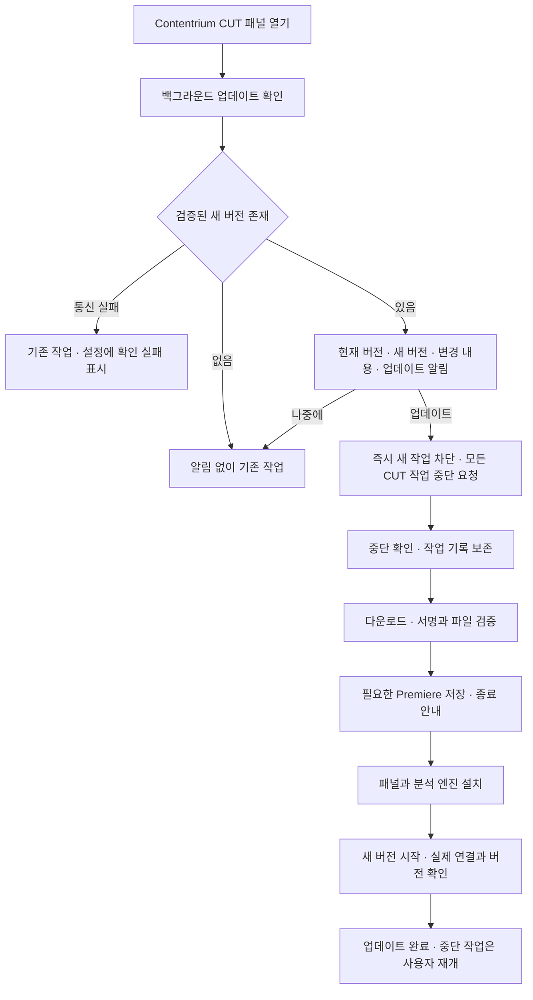

# Contentrium CUT — GitHub 배포와 자동 업데이트 설계

작성: 2026-10-05 · 2026-10-06 즉시 시작 보완 · [전체 설계](../2026-10-05-premiere-speaker-cut-design.md)

사용자 요구는 **플러그인을 열 때 업데이트를 확인하고, 없으면 그대로 사용하며, 있으면 알리고, `업데이트`를 누르면 진행 중인 Contentrium CUT 작업을 즉시 중단하여 업데이트를 시작하는 것**이다. 자동 확인과 사용자 선택 후 설치를 구별한다. 새 버전을 발견했다는 이유만으로 편집을 중단하거나 설치하지 않는다.

이 문서는 배포·중단·설치·복구의 계약이다. 저장소와 0.1.0 공개는 존재하며, 이후 구현·검증은 [최신 검수 기록](../../../qa/2026-10-06-update-responsiveness.md)을 따른다. 실제 설치·활성화 시험과 소스·패키지 검증은 구분한다.

## 1. 제품명과 배포 위치

| 항목 | 설계값 | 적용 규칙 |
| --- | --- | --- |
| 제품 표시 이름 | **Contentrium CUT** | 패널 제목, 설치 화면, 앱 목록, 업데이트 창에 동일하게 사용 |
| 시각 스타일 | Mono Studio | 디자인 방향이며 제품명으로 사용하지 않음 |
| GitHub 소유자 | `contentriumkorea` | 2026-10-05 공개 계정 조회로 확인 |
| 저장소 이름 | `contentrium-cut` | 제품명을 공백 없는 GitHub 경로로 표현한 제안값 |
| 배포 경로 | `https://github.com/contentriumkorea/contentrium-cut` | 기존 저장소와 Releases를 사용 |
| 배포 위치 | 위 저장소의 GitHub Releases | 별도 `-release`, `-releases`, `-릴리즈` 저장소를 만들지 않음 |
| 공개 버전 제목 | `Contentrium CUT` | 제목 뒤에 릴리즈·정식판 등의 문구를 붙이지 않음 |
| 버전 태그 | `vMAJOR.MINOR.PATCH` | 예: `v0.1.0`. 제품명과 별도 필드로 표시 |
| UXP 설치 ID | `com.contentrium.cut` 제안 | 최초 배포에서 확정한 ID를 업데이트 내내 유지 |
| Windows 설치 식별자 | 고정 제품 ID | 매 버전 새 앱으로 중복 등록하지 않음 |

공개 배포 저장소 하나에 소스·빌드 정의와 설치 자산을 관리하는 안이다. 최초 생성 시 공개 범위를 확인하고, 실제 촬영 자료·프로젝트·토큰·인증서 개인키·이용 조건상 재배포할 수 없는 모델은 포함하지 않는다. 기존 로컬 프로젝트 폴더와 문서 파일명은 연결 보존을 위해 유지한다.

제안 자산은 `Contentrium-CUT-Setup.exe`, `Contentrium-CUT.ccx`, `Contentrium-CUT-Windows-x64.zip`, `update-manifest.json`, `update-manifest.sig`다. 동일 이름은 각 버전의 Release 안에서 구별된다. EXE는 최초 설치·복구용, ZIP과 CCX는 업데이트 관리자용이다. EXE 안의 구성도 같은 빌드의 해시와 일치해야 한다. 소프트웨어 설치 파일·연결 자산에는 개별 문서 납품용 날짜 접두사를 붙이지 않는다.

## 2. 사용자 흐름



알림의 `업데이트` 클릭이 실행 동의다. 같은 내용을 다시 묻는 앱 확인창을 추가하지 않는다. 운영체제·Adobe 설치 권한 창은 플랫폼에서 요구하면 정상적으로 표시한다. `나중에`는 그 패널 세션의 큰 알림을 접으며 설정의 업데이트 표시는 유지한다. 다음에 플러그인을 열면 다시 확인한다.

업데이트로 멈추는 범위는 **같은 설치를 사용하는 모든 Contentrium CUT 작업**이다. Premiere 전체 프로세스, 사용자의 수동 편집, 다른 플러그인·렌더러를 강제로 종료하는 명령이 아니다. 업데이트를 선택하기 전에는 일반 작업을 계속 사용할 수 있다.

## 3. 시작 시 확인과 알림 정책

1. 패널 진입 직후 현재 설치 버전과 업데이트 관리자의 상태를 읽는다. 편집 UI 표시와 네트워크 확인을 병렬로 진행한다.
2. 동일 설치의 업데이트 관리자 한 개가 GitHub 메타데이터를 요청한다. 여러 패널이 동시에 열리면 진행 중인 같은 확인 요청을 공유한다.
3. 패널을 새로 열 때마다 확인을 요청한다. 정상 응답의 ETag를 보관해 조건부 요청을 할 수 있으나, 오래된 캐시만 보고 최신이라고 단정하지 않는다. 명시된 GitHub 재시도 제한 중에는 남은 대기시간을 따른다.
4. 공개된 안정 버전인지, 서명된 제품·플랫폼·버전·호환성 정보가 맞는지 검사한다. 확인 단계에서 받는 것은 작은 메타데이터와 manifest·서명이며 설치 본체는 버튼을 누른 뒤 받는다.
5. 새 버전이 없으면 배너·팝업·완료 토스트 없이 종료한다. 설정에서만 현재 버전과 마지막 성공 확인 시각을 볼 수 있다.
6. 새 버전이면 패널 위쪽에 인라인 알림을 띄운다. 주 작업의 포커스를 빼앗는 강제 모달을 반복하지 않는다. `나중에`를 누르기 전까지 알림은 남는다.
7. 자동 확인이 실패하면 기존 기능을 사용할 수 있다. 설정에는 `업데이트를 확인하지 못했습니다`와 재시도 동작을 남기며 `최신 버전`으로 표시하지 않는다. 사용자가 직접 확인한 경우 실패 결과를 그 화면에 표시한다.

확인 요청의 제안 시간 제한은 연결 5초, 전체 15초다. 설치 다운로드는 별도의 전송 제한·재시도 정책을 사용한다. 매초 GitHub를 조회하거나 패널을 열지 않았는데 예약 확인을 반복하지 않는다. 네트워크가 없어도 이미 준비된 로컬 분석 기능은 동작해야 한다.

| 결과 | 제품 동작 |
| --- | --- |
| 유효한 원격 버전 = 현재 버전 | 조용히 통과 |
| 유효한 원격 버전 < 현재 버전 | 자동 다운그레이드 없이 통과. 진단에 버전 관계 기록 |
| 새 안정 버전 + 호환 | 업데이트 알림과 활성 `업데이트` 버튼 |
| 새 안정 버전 + Premiere/OS 불일치 | 새 버전 알림, 필요한 환경 설명, 설치 버튼 비활성 |
| 새 버전 + 기존 업데이트 관리자가 직접 설치할 수 없음 | 검증된 공식 설치 파일을 통한 갱신 안내. 지원 안 되는 자동 경로 실행 금지 |
| draft·prerelease | 기본 안정 채널 알림 대상에서 제외 |
| GitHub 304 | 이전의 검증된 해당 응답과 함께 판단. 캐시가 없으면 재조회 |
| 404·오프라인·timeout·잘못된 JSON | 확인 실패. 최초 버전 미발행/권한 문제도 가능하므로 최신으로 간주하지 않음 |
| 403·429 제한 응답 | 제한 여부와 Retry-After/reset 확인, 기한 전 반복 호출 금지 |
| manifest 서명·제품·자산 정보 불일치 | 신뢰 확인 실패, 설치 불가 |

## 4. GitHub 조회와 버전 계약

배포 후 기준 엔드포인트는 `GET https://api.github.com/repos/contentriumkorea/contentrium-cut/releases/latest`다. GitHub API 요청에는 `Accept: application/vnd.github+json`과 채택한 API 버전을 사용한다. 바이너리 asset API를 사용할 때의 `application/octet-stream`을 메타데이터 요청에 재사용하지 않는다. 브라우저 HTML이나 저장소 최신 커밋을 긁어 설치 버전을 판단하지 않는다. [GitHub Releases API][github-releases]

공개 Release 조회·다운로드에 콘텐츠리움의 PAT를 제품에 넣지 않는다. 최초 배포는 일반 사용자가 로그인 없이 접근할 수 있는 자산을 전제로 한다. 비공개 저장소 전환은 별도 인증 설계가 필요하며 현재 계획에 조용히 추가하지 않는다.

GitHub의 latest 선택을 SemVer 최댓값으로 가정하지 않는다. 배포 파이프라인에서 안정 버전의 latest를 관리하고, 클라이언트도 `tag_name`, 서명된 `appVersion`, 현재 버전을 파싱해 비교한다. `1.10.0 > 1.9.0`을 문자열 비교로 처리하지 않는다. `v`는 태그 접두사이며 build metadata만 달라진 파일로 같은 버전을 덮어 배포하지 않는다.

대상은 검증된 releaseId·tag·manifest digest·assetId로 고정한다. 사용자가 버튼을 누른 후 latest가 바뀌어도 다른 버전으로 몰래 갈아타지 않는다. 게시물이 철회되었거나 필요한 자산이 없어졌으면 해당 시도는 실패로 종료하고 다시 확인하도록 안내한다.

조건부 조회, 일시적 오류의 제한된 재시도, 제한 응답의 대기는 GitHub 지침을 따른다. 인증 없는 304 응답이 항상 API 사용량에서 제외된다고 보장하지 않는다. 공개 endpoint의 실제 응답을 배포 후 확인한다. [GitHub REST 사용 지침][github-best-practices]

## 5. 배포 manifest와 신뢰 경계

`update-manifest.json`은 버전별 설치 계약이며, 변경 내용 텍스트나 Release 제목은 실행 지시가 아니다. 알림 문구의 HTML·스크립트는 실행하지 않는다. 서명은 manifest의 정확한 UTF-8 바이트에 적용하는 분리 서명으로 제안하며 클라이언트에서 JSON을 재직렬화한 바이트를 검증하지 않는다.

| 필드 | 용도·검증 |
| --- | --- |
| schemaVersion, productId, displayName | 읽을 수 있는 스키마, 고정 제품 ID, `Contentrium CUT` 확인 |
| appVersion, channel, releaseId, tag, builtAt | 안정 채널·버전·GitHub 식별자 일치, 빌드 시각 기록 |
| platform, architecture | 첫 배포는 Windows x64 검증 대상. 다른 플랫폼 자산 오설치 방지 |
| premiereCompatibility | 최소 조건과 실제 시험한 빌드 목록을 구별 |
| panelVersion, companionVersion, bundleId | 한 배포 묶음의 패널·분석 엔진 조합 식별 |
| updateProtocolRange, minUpdaterVersion | 설치·복구 절차를 현재 관리자가 이해할 수 있는지 확인 |
| dataSchemaFrom, dataSchemaTo, migrationId | 지원하는 데이터 이동·복구 경로 식별 |
| assets | 설치 자산의 역할, assetId, 파일명, 바이트 수, SHA-256. 자기 자신과 서명 파일은 이 목록에서 제외 |
| modelCompatibility | 필수 모델 역할과 사용 가능한 revision. 기존 모델 재사용 판단 |
| releaseNotes | 사용자용 변경 내용. 실행 코드·임의 설치 명령 없음 |
| signingKeyId | 번들에 신뢰 키로 등록된 공개키 중 선택. manifest가 새 신뢰 키를 스스로 지정할 수 없음 |

실제 발행 시각 `published_at`은 공개된 GitHub Release 응답에서 표시한다. draft 단계에서 서명하는 manifest에 아직 결정되지 않은 발행 시각을 넣어 공개 후 다시 고치는 구조를 만들지 않는다. migrationId는 검증된 패키지 안의 알려진 migration을 선택하며 임의 셸 명령을 담지 않는다.

클라이언트에 공개키를 고정하고, 별도 보관한 개인키로 배포 manifest를 서명하는 안을 채택한다. Ed25519 같은 표준 검증 라이브러리를 사용하며 자체 암호 알고리즘을 만들지 않는다. 키 교체는 기존 신뢰 경로로 검증한 업데이트 또는 서명된 복구 설치 파일로 진행한다. GitHub 계정에 접근했다는 사실이나 같은 Release 안의 해시 파일만으로 발행자를 인증하지 않는다.

자산은 검증한 GitHub asset 응답에서 가져온 HTTPS 경로만 사용한다. 리디렉션은 GitHub 배포에 필요한 CDN 호스트를 실제 확인해 허용하고 임의 도메인·HTTP 전환·자격 증명 유출을 막는다. `.part`로 내려받아 크기·서명·SHA-256 검증 후 준비된 자산으로 이동한다. ZIP의 절대 경로, `..`, 재분석 지점·링크를 통한 설치 폴더 탈출을 거부한다.

Windows 실행 파일의 코드 서명도 배포 관문에 넣되 인증서가 이미 준비되었다고 가정하지 않는다. Adobe CCX 설치 형식과 자체 업데이트 서명은 별도 계약이다. CCX 자체의 CEP식 서명 요구와 혼동하지 않는다. [Adobe 패키징][adobe-package]

## 6. 업데이트 클릭과 즉시 중단

2026-10-06 보완: 클릭 순간 로컬 업데이트 의도를 유지하고 미리보기 종료 응답과 독립적으로 서버 중단을 요청한다. 원격 확인은 인증 요청 큐 밖의 백그라운드 작업으로 수행하며 중복 확인은 합친다. 기존 서명 후보는 재확인 중에도 유효성·만료·호환성 검사를 거쳐 시작할 수 있다. 응답 유실 시 같은 요청 ID를 사용하며, 늦은 확인 결과나 이전 epoch의 상태로 작업을 재개하지 않는다. 미리보기·native 트랜잭션의 실제 종료와 Premiere 정상 종료 관문은 유지한다.

업데이트 버튼 이벤트에서 **네트워크 다운로드보다 먼저** 현재 패널의 실행 버튼을 잠그고, 업데이트 관리자가 같은 설치 전체의 `updateEpoch`를 올려 작업 진입을 차단한다. 동시에 모든 등록 패널·Companion 작업에 중단 신호를 보낸다. 작업 완료까지 기다렸다가 업데이트를 시작하는 예약 방식은 사용하지 않는다.

| 대상 | 중단 동작 | 보존할 내용 |
| --- | --- | --- |
| 대기 작업·재시도 타이머 | 새 실행 차단, 큐 작업 취소 | 입력과 작업 목록 |
| 디코딩·싱크·화자 분석 | 취소 신호, 출력 commit 차단, 소유 작업 프로세스 종료 확인 | 이미 검증된 완료 청크와 입력 |
| GPU 모델 추론 | 전용 worker 중단 요청. 응답이 없으면 소유 프로세스만 종료하는 경로 | 완료 결과만 유지, 미완성은 폐기 표시 |
| 편집 계획·파형·예시 재생 | 즉시 중지 요청, 새 산출물 등록 차단 | 매핑·사용자 교정·검토 이력 |
| 모델·캐시 다운로드 | 취소, 일부 파일을 사용 가능으로 등록하지 않음 | 검증된 기존 모델, 재개 가능한 임시 다운로드 |
| Premiere 편집 적용 | 이미 시작한 짧은 transaction 반환 후 다음 transaction 금지 | batch intent·실제 확인 상태·부분 시퀀스 ID |
| 적용 결과 검사 | 다음 검사 중단, 완료 승격 금지 | 현재까지 확인한 사실과 미확인 표시 |

`즉시`는 클릭 시 신규 작업 차단과 취소를 시작한다는 뜻이다. 호출 중인 Premiere API를 메모리 중간에서 강제 절단한다고 약속하지 않는다. 호스트에 넘긴 짧은 transaction 하나는 반환까지 기다리고, 이후 작업은 실행하지 않는다. UI에는 그 동안 `편집 명령 중단 확인 중`을 표시한다. 호스트가 멈춰 응답이 없으면 설치를 강행하지 않는다.

분석 worker의 협력 취소 유예는 초기 3초를 제안하고 실측한다. 그 후에는 해당 작업을 위해 시작한 worker/자식 디코더만 프로세스 ID·시작 시각·실행 경로·소유 정보를 확인해 종료할 수 있다. 같은 이름의 모든 Python/FFmpeg 프로세스를 일괄 종료하지 않는다. 제어·journal 프로세스와 모델 worker를 분리해 추론 종료가 기록 저장과 업데이트 관리자까지 죽이지 않도록 한다.

완료 cache commit과 업데이트 중단은 같은 admission gate로 직렬화한다. 중단보다 먼저 확정한 결과는 보존하고, 중단 이후 늦게 도착한 worker 응답은 완료로 등록하지 않는다. 이미 실행한 호스트 명령은 실제 반영 여부를 기록하며 자동 Undo·프로젝트 강제 저장·원본 되돌리기를 실행하지 않는다.

## 7. 여러 패널·재연결·중복 클릭

설치 단위 업데이트 관리자 한 개와 잠금을 둔다. 같은 설치를 사용하는 모든 Premiere 인스턴스·패널·Companion이 참여한다. panelSessionId, process identity, jobId, updateEpoch를 등록하고 각 호스트 transaction 직전에도 유효한 실행 허가를 확인한다. 일반 진행률의 1~2초 polling만으로 중단을 구현하지 않는다.

업데이트 관리자는 새 작업·batch 허가를 즉시 거부한다. 이미 발급한 짧은 허가는 취소 상태와 유효 기한을 확인하며, 시작된 batch의 중단 확인을 기다린다. 응답 없는 패널을 ‘중단 완료’로 간주하지 않는다. 모든 참여자의 중단 확인 또는 해당 프로세스의 실제 종료를 확인한 뒤 파일 교체를 허용한다.

중복 클릭은 requestId와 동일 후보 ID로 한 updateId를 반환한다. 두 설치 프로세스를 실행하지 않는다. 닫힌 패널이 다시 열리면 updateEpoch·journal을 먼저 읽고 업데이트 화면으로 연결한다. 이전 epoch의 작업 요청·완료 응답·편집 허가는 거부한다. 다른 Windows 사용자 세션 등 설치 파일을 공유하는 참여자의 정지 여부를 확인할 수 없다면 설치는 대기·차단한다.

## 8. 업데이트 관리자와 로컬 인터페이스

UXP 패널은 알림·사용자 선택·호스트 중단을 맡고, **독립 업데이트 관리자**가 확인·다운로드·검증·설치·복구를 맡는다. Companion의 무거운 분석 worker가 꺼지거나 Premiere가 종료되어도 업데이트 절차가 지속되어야 한다. 패널에서 Adobe 설치 폴더를 직접 덮어쓰거나 임의 셸 명령을 실행하지 않는다.

아래 경로는 제품 내부 제안 API다. `/v1/jobs`와 분리된 업데이트 관리자에서 제공하며 인증·loopback 제한·Origin 검증·requestId 계약은 메인 설계를 따른다. 발견·pairing·최소 프로토콜은 이전 패널도 업데이트 상태를 읽을 수 있게 유지한다.

| 경로 | 역할 |
| --- | --- |
| `POST /v1/updates/check` | 패널 열기/직접 확인. requestId, reason만 받음. 임의 저장소·URL 입력 금지 |
| `GET /v1/updates/state` | checkState, updateState, updateId, epoch, 후보·단계·필요 행동 |
| `POST /v1/updates/start` | 검증된 candidateId, manifestDigest, requestId로 업데이트 시작과 전역 차단 |
| `POST /v1/updates/participants/ack` | 등록 참여자의 취소 확인·진행 batch·receipt 위치 보고 |
| `POST /v1/updates/cancel` | 파일 교체 전 취소 요청. 교체 중에는 복구 절차로 처리 |

알 수 없는 후보·만료 후보·서명 불일치·호환성 실패는 시작을 거부한다. 클릭 후 후보가 무효가 된 경우에도 이미 시작한 작업 중단을 취소해 몰래 재개하지 않는다. 이전 설치가 정상임을 확인한 뒤 사용자가 다시 실행한다.

업데이트 관리자 연결이 끊겼다면 해당 패널의 작업은 먼저 중단하고 `업데이트 관리자에 연결할 수 없습니다`를 표시한다. 다른 참여자까지 정지했다고 주장하지 않으며 관리자 복구 전에는 설치를 진행하지 않는다. 앱 실행 경로·Windows 권한·Adobe 설치 요구는 실제 배포 환경에서 시험한다.

## 9. 상태 전이와 기록

확인 상태와 설치 상태를 분리한다. 확인 상태는 `CHECKING`, `CURRENT`, `AVAILABLE`, `INCOMPATIBLE`, `CHECK_FAILED`다. `CURRENT`는 성공한 원격 검증 결과에서만 설정한다. 설치 정상 흐름은 다음과 같다.

```text
IDLE → STOP_REQUESTED → QUIESCING → DOWNLOADING → VERIFYING_PACKAGE
     → WAITING_HOST_EXIT → INSTALLING → PENDING_ACTIVATION
     → VERIFYING_INSTALL → COMPLETE
```

`WAITING_HOST_EXIT`는 교체에 필요한 호스트가 이미 닫혀 있으면 통과한다. 취소는 교체 전에 `CANCELED`로 끝낼 수 있다. 교체 전 실패는 `FAILED_BEFORE_REPLACE`, 교체 후 실패는 `ROLLING_BACK → ROLLED_BACK` 또는 `RECOVERY_REQUIRED`다. 설치 프로그램 exit code 0만으로 `COMPLETE`를 만들지 않는다.

journal에는 updateId, requestId, candidateId, releaseId, old/newVersion, bundleId, epoch, 단계, 참여자 중단 확인, 준비 자산 해시, 이전 설치 위치, 데이터 snapshot, installer 결과, 재시작 후 확인 결과를 기록한다. 각 변경 intent를 먼저 영속 저장하고 실제 확인 후 commit한다. 완료 기록의 저장·동기화가 끝나기 전에 UI에 완료 상태를 공개하지 않는다.

앱 종료·정전 뒤에는 journal을 읽어 다운로드 재개, 기존 버전 유지, 새 버전 검증, 복구 중 하나로 결정한다. 불완전한 기록은 성공으로 추정하지 않는다. 로그에는 사용자 원음·대사·토큰을 넣지 않는다.

## 10. 설치·재시작·버전 일치

Adobe는 CCX 직접 배포와 Creative Cloud Desktop/UPIA 설치 경로를 문서화한다. Windows의 UPIA `/install <path>`와 설치 목록 조회를 후보로 사용한다. 실제 인자·권한·같은 ID 업데이트·낮은 버전 복구 결과는 설치 시험에서 확정한다. UXP의 실행 중 교체나 무조건 무인 설치가 보장된다고 해석하지 않는다. [Adobe 설치 안내][adobe-install]

첫 지원 버전의 기본 정책은 다음과 같다.

1. 즉시 중단과 기록 보존을 완료한다. 디스크 공간, 설치 도구, 호환성을 검사한다.
2. 모든 새 자산을 staging에 내려받고 검증한다. 실패하면 기존 설치를 그대로 둔다.
3. 기존 CCX·Companion·업데이트 관리자와 데이터 복구 지점을 확보한다. 검증할 수 있는 이전 패키지가 없으면 자동 복구 가능이라고 표시하지 않는다.
4. Premiere를 저장하고 정상 종료하도록 안내한다. 최초 출시에서는 **Premiere가 닫힌 뒤 패널 파일을 교체**하는 정책을 적용한다. 이는 우리 제품의 보수적인 설치 정책이며 모든 Adobe 버전의 필수 규칙이라는 주장은 아니다.
5. 패널이 닫힌 동안 작은 독립 업데이트 창에서 단계·상태·재시작 필요를 표시한다. 프로젝트 강제 저장이나 Premiere 강제 종료를 하지 않는다.
6. 기록을 저장한 기존 Companion 제어 프로세스와 분석 worker가 종료된 것을 확인하고 새 Companion을 버전별 폴더에 준비한다. 동일 UXP ID의 CCX를 공식 설치 경로로 갱신한다.
7. 새 Companion, 패널, bundleId, 통신·데이터 스키마를 함께 확인한다. 일시적인 혼합 버전 상태에서는 작업을 허용하지 않는다.
8. 사용자가 Premiere를 다시 실행해 패널을 열면 실제 로드된 버전과 handshake·데이터 읽기를 확인하고 모델별 준비 상태를 별도 표시한다. 이때까지는 `설치됨 · Premiere에서 확인 필요`이며 완료가 아니다.
9. 성공 기록을 영속화한 뒤 `COMPLETE`와 업데이트 완료 안내를 표시한다. 중단된 분석·부분 시퀀스 적용은 자동 재개하지 않는다.

지원 환경에서 안전한 실시간 교체가 추후 검증되면 재시작 요구를 줄일 수 있다. 현재는 `한 번 누르면 어떤 상태에서도 Premiere를 켠 채 완료`라고 약속하지 않는다. 업데이트 도중 `취소`하면 내려받기는 멈출 수 있으나 이미 교체한 설치는 임의로 방치하지 않고 완료 또는 복구까지 진행한다.

## 11. 파일 배치와 데이터 보존

| 제안 위치 | 내용 | 업데이트 동작 |
| --- | --- | --- |
| `%LOCALAPPDATA%\Contentrium CUT\app\<version>\` | Companion·런타임·업데이트 구성 | 새 버전을 별도 준비, 검증 후 활성 버전 전환 |
| `%LOCALAPPDATA%\Contentrium CUT\data\` | 설정·작업·매핑·교정·receipt | 설치 파일과 분리, migration 전 복구 사본 |
| `%LOCALAPPDATA%\Contentrium CUT\models\` 또는 사용자 지정 폴더 | 모델·revision·라이선스 | 호환 모델 재사용, 업데이트마다 전체 다운로드하지 않음 |
| `%LOCALAPPDATA%\Contentrium CUT\cache\` 또는 사용자 지정 폴더 | 재생성 가능한 분석 캐시 | 활성·중단 작업의 기록과 구별, 캐시 스키마 검사 |
| `%LOCALAPPDATA%\Contentrium CUT\updates\` | staging·journal·이전 검증 패키지 | 정전 복구·이전 버전 복구에 필요한 동안 유지 |
| Adobe가 관리하는 UXP 설치 영역 | CCX 설치 결과 | 공식 설치 도구로만 변경 |
| 사용자의 기존 프로젝트·미디어 위치 | 원본·새 편집 결과 | 이동·삭제·일괄 이름 변경 안 함 |

활성 버전 포인터를 원자적으로 바꿀 수 있어도 Adobe 설치와 데이터 migration까지 하나의 원자적 transaction은 아니다. 단계별 journal과 역순 복구로 관리한다. 사용자 데이터를 새 스키마로 바꿀 때 원본을 덮어쓰지 않고 복사본을 검증한 뒤 전환한다. 호환성 범위 밖의 데이터는 구버전에 그대로 넘기지 않는다.

업데이트 관리자 자신의 교체도 버전별 파일을 준비한 뒤 다음 실행에서 전환한다. 실행 중인 자신의 EXE를 덮어쓰지 않는다. 고정 bootstrap이 새 관리자를 실행하는 최소 경로를 맡고, bootstrap 자체 교체는 검증한 설치 프로그램 경로로 처리한다.

새 버전 활성화·기본 확인이 끝난 뒤에만 불필요한 구버전 프로그램 정리를 허용한다. 첫 배포에서는 최소 한 개의 검증된 직전 버전과 복구 패키지를 유지한다. 모델·원본·사용자 설정·미확인 백업을 구버전 정리 대상으로 포함하지 않는다.

모델 준비 상태는 앱 업데이트 성공과 별도로 유지한다. 기존 호환 모델은 재사용하고 새 revision이 필요하면 크기·조건을 모델 관리에서 표시한다. 사용자 약관 동의가 필요한 모델을 자동 승인하지 않는다. 앱 설치가 정상이어도 모델이 준비되지 않은 해당 분석 기능은 MODEL_NOT_READY로 막으며, 이것만으로 정상 앱 설치를 실패·복구 처리하지 않는다.

## 12. 실패와 복구

| 실패 시점 | 처리 | 사용자 표시 |
| --- | --- | --- |
| 확인·manifest 검증 | 설치하지 않음, 기존 기능 사용 | 설정에 확인 실패/신뢰 확인 실패 |
| 작업 중단 확인 | 파일 교체 금지, 응답 없는 참여자 안내 | `작업 중단을 확인하지 못했습니다` |
| 다운로드·공간·해시 | 기존 설치 유지, 부분 파일은 미완성 | `업데이트 파일을 준비하지 못했습니다` |
| 사용자 권한 창 취소·호스트 미종료 | 진행 단계 보존, 기존 설치 상태 확인 | `설치를 계속하려면 …` |
| CCX 또는 Companion 일부만 갱신 | 작업 잠금 유지, 이전 묶음 복구 | `이전 버전으로 복구 중` |
| 새 버전 handshake·migration 실패 | 검증된 이전 묶음과 데이터 사본으로 복구 시도 | `새 버전을 시작하지 못했습니다` |
| Adobe 이전 CCX 재설치 거부·복구 실패 | 원본·데이터·양쪽 패키지 보존, 공식 복구 설치 경로 안내 | `복구 설치가 필요합니다` |
| 전원 차단·강제 앱 종료 | 다음 시작에서 journal 대조 후 단계 복구 | `중단된 업데이트를 확인하고 있습니다` |

자동 복구는 검증한 범위에서 제공한다. CCX 다운그레이드나 모든 설치 오류의 복구를 무조건 보장하지 않는다. 복구도 실제 패널·Companion 버전과 연결 확인을 통과해야 `ROLLED_BACK`으로 표시한다. 상태가 불명확하면 `RECOVERY_REQUIRED`로 잠그며 거짓 완료로 넘어가지 않는다.

교체 전 취소·실패 후 기존 버전이 정상임을 확인하면 사용자가 기존 작업을 다시 실행할 수 있다. 업데이트가 실패했다는 이유로 중단된 컷 적용을 자동으로 이어 붙이지 않는다. 새 시도 전 snapshot·receipt·실제 시퀀스를 다시 확인한다.

## 13. GitHub 게시 절차

1. `contentriumkorea/contentrium-cut` 저장소와 고정 제품 ID를 확정한다. 별도 릴리즈 접미사 저장소를 만들지 않는다.
2. 소스 revision에서 같은 appVersion·bundleId의 패널·Companion·설치 프로그램을 빌드한다. 핵심 기능과 업데이트 시험을 통과한다.
3. Release를 draft로 만들고 제목은 `Contentrium CUT`, 태그는 `vMAJOR.MINOR.PATCH`로 지정한다. 변경 내용·지원 환경·재시작 요구를 적는다.
4. 모든 설치 자산을 업로드한 뒤 assetId·크기·해시를 담은 manifest와 서명을 올린다. secret은 저장소 소스와 패키지에 포함하지 않는다.
5. 자산이 전부 준비되면 안정 버전으로 공개하고 latest를 명시적으로 관리한다. 가능하면 GitHub immutable releases를 활성화해 공개 후 태그·설치 자산 교체를 막는다. [GitHub 불변 Release][github-immutable]
6. 공개 후 인증 없는 실제 API 조회·자산 다운로드를 검사한다. 이전 설치에서는 새 버전 알림, 현재 설치에서는 조용한 통과, 알림 클릭 후 중단·설치·재시작·검증을 시험한다. 내부 mock만 통과한 것을 배포 성공으로 처리하지 않는다.
7. 배포 문제가 있으면 latest를 검증된 버전으로 되돌려 신규 노출을 중지하고 기존 자산을 몰래 바꾸지 않는다. 이미 새 버전 사용 중인 클라이언트는 자동 다운그레이드하지 않는다. 수정은 증가한 패치 버전으로 게시한다.

미디어·분석 데이터는 GitHub 업데이트 요청에 첨부하지 않는다. GitHub에는 버전 확인·자산 전송에 필요한 네트워크 요청이 발생하며 IP 등 일반 접속 정보가 보일 수 있다. 제품이 보내는 payload에 프로젝트 이름·경로·화자 이름·원음·전사를 넣지 않는다.

## 14. 업데이트 검증 관문 G7

아래는 구현 후 수행할 시험이며 현재 통과를 의미하지 않는다. 실제 설치한 구버전과 게시한 후보 버전, 실패 주입 환경에서 증거를 남긴다.

| ID | 시나리오 | 합격 조건 |
| --- | --- | --- |
| U01 | 같은 버전으로 패널 열기 | 자동 확인, 배너·팝업·완료 토스트 0회 |
| U02 | 더 높은 안정 버전 | 실제 버전·변경 내용·크기 표시, 사용자 클릭 전 작업 지속 |
| U03 | `나중에` 후 다시 열기 | 현재 세션 알림 접힘, 다음 진입에서 재확인 |
| U04 | 오프라인·404·잘못된 응답 | 로컬 작업 가능, 최신으로 거짓 표시하지 않음 |
| U05 | 304·403·429 | 캐시 조건·제한 시간 준수, 요청 폭주 없음 |
| U06 | 공개 GitHub API·asset 헤더 | 메타데이터 JSON 정상, 바이너리와 Accept 혼용으로 415 발생하지 않음 |
| U07 | SemVer·prerelease·낮은 버전 | 정확한 비교, 안정 채널과 다운그레이드 규칙 준수 |
| U08 | 지원 안 되는 호스트·업데이트 프로토콜 | 이유 표시, 지원 안 되는 자동 설치 차단 |
| U09 | 싱크·CPU/GPU 분석 중 업데이트 | 클릭 즉시 새 작업 차단·중단 요청, 완료까지 기다리지 않음 |
| U10 | worker 응답 지연·늦은 완료 응답 | 소유 프로세스만 중단, 취소 이후 완료 cache 등록 없음 |
| U11 | Premiere transaction 실행 중 | 현재 짧은 호출 뒤 다음 batch 0개, 원본 보존·부분 결과 기록 |
| U12 | 여러 패널·중복 클릭·재연결 | updateId 한 개, 모든 참여자 확인 전 교체 없음 |
| U13 | 서명·해시·제품 ID 변조, ZIP 경로 탈출 | 실행·설치 차단, 기존 설치 보존 |
| U14 | 다운로드 단절·디스크 부족·권한 거부 | 실패 단계 명확, 기존 정상 설치 또는 복구 가능 상태 유지 |
| U15 | Premiere 열림·저장 안 된 프로젝트 | 정상 종료 안내, 강제 종료·자동 저장 없음 |
| U16 | 같은 ID CCX 갱신·일부 구성 실패 | 중복 플러그인 없음, 혼합 버전 작업 차단, 검증된 복구 또는 복구 필요 표시 |
| U17 | 설치 각 단계에서 전원 차단 | journal로 재판정, 미확인 완료 없음 |
| U18 | 설정·모델·매핑·원본 보존 | 업데이트 전후 사용자 데이터·원본 대조, 불필요한 모델 재다운로드 없음 |
| U19 | 새 버전 실행·데이터 migration 실패 | 검증한 이전 조합 복구 또는 RECOVERY_REQUIRED, 자동 편집 재개 없음 |
| U20 | 설치 성공 후 Premiere 재실행 | 실제 로드 버전·bundleId·handshake 검증 후에만 COMPLETE |
| U21 | 후보 선택 후 latest 변경·자산 철회 | 선택한 release 고정 또는 명시적 실패, 다른 버전 몰래 설치하지 않음 |
| U22 | 완료 상태·journal 저장 경쟁 | 완료 저장 실패 시 성공 표시 없음, 재시작 후 같은 판정 |
| U23 | 제품명·배포 경로 검수 | UI·설치·Release 제목은 Contentrium CUT, 저장소에 릴리즈 접미사 없음 |

중단 지연, 최대 호스트 transaction 시간, 다운로드·설치 시간은 실제 로그로 측정해 지원 기준을 정한다. 하드 기준은 원본 변경 0, 새 작업 무단 실행 0, 잘못된 버전 조합의 분석·적용 0, 검증 전 완료 표시 0이다.

## 15. 현재 확인한 근거와 미검증 범위

- 2026-10-05 GitHub API에서 `contentriumkorea` 계정을 확인했다. `contentriumkorea/contentrium-cut` 조회는 404였고 조회 가능한 저장소 목록에서도 해당 이름을 확인하지 못했다. 따라서 위 주소는 배포 예정 경로다.
- 로컬에서 `C:\Program Files\Common Files\Adobe\Adobe Desktop Common\RemoteComponents\UPI\UnifiedPluginInstallerAgent\UnifiedPluginInstallerAgent.exe`와 파일 버전 `8.5.0.13`을 읽었다. 설치 명령을 실행하지 않았고 업데이트·복구 성공 증거는 아니다.
- Adobe 문서는 CCX 직접 배포·UPIA 경로의 근거다. 실행 중 교체, 요구 권한, 같은 ID의 갱신, 재시작, 구버전 복구, 실제 패널·Companion 연결은 G7에서 확인한다.
- 확인 실패 시 통과, 즉시 중단 범위, 데이터 보존, 독립 관리자, 서명 검증, 복구 정책은 Contentrium CUT의 제품 설계 결정이다. GitHub나 Adobe가 전체 절차를 대신 보장한다고 표현하지 않는다.

[adobe-install]: https://developer.adobe.com/premiere-pro/uxp/plugins/distribution/install/
[adobe-package]: https://developer.adobe.com/premiere-pro/uxp/plugins/distribution/package/
[github-releases]: https://docs.github.com/en/rest/releases/releases
[github-best-practices]: https://docs.github.com/en/rest/using-the-rest-api/best-practices-for-using-the-rest-api
[github-immutable]: https://docs.github.com/en/code-security/concepts/supply-chain-security/immutable-releases
